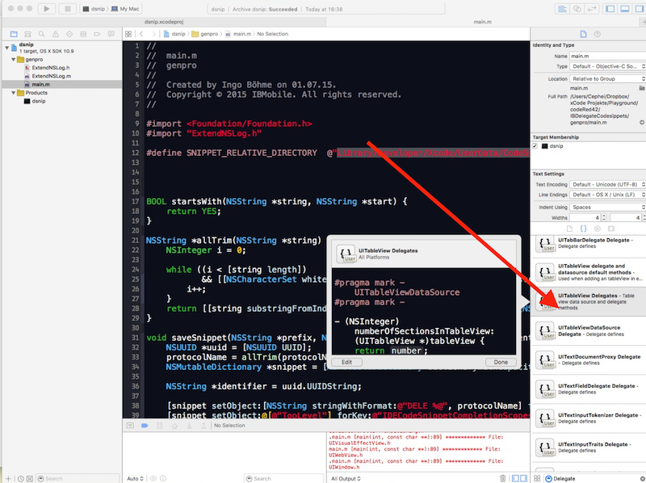
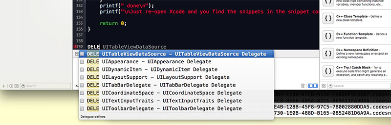

# dsnip - Create code snippets from UIKit protocols

Can you remember all dlegate methods from UITableViewDatasource? And which ones are optional and which ones are required? This command line tool extracts all these information from the header files of the current iOS installed in the Xcode.app in your application folder 

I wrote this little command line program for me, but I´m sure its valuable to may other XCode developer (especially iOS developer as I focussed on the iOS SDK) as well.

It´s done quick & dirty as I wanted the result (that you find in the codesnippet folder) - a beauty contest was never in my mind ;-) But if you want to make it more flexible ... hey ... perfect for me ;-)

It generats the Xcode codesnippet files for all protocols in the UIKit elements, like ... 

`NSTextAttachmentContainer,
NSTextLayoutOrientationProvider,
NSTextStorageDelegate,
UIAccelerometerDelegate,
UIAccessibilityIdentification,
UIAccessibilityReadingContent,
UIActionSheetDelegate,
UIActivityItemSource,
UIAdaptivePresentationControllerDelegate,
UIAlertViewDelegate,
UIAppearance,
UIApplicationDelegate,
UIBarPositioningDelegate,
UICollectionViewDelegate,
UICollectionViewDelegateFlowLayout,
UICollisionBehaviorDelegate,
UIContentContainer,
UICoordinateSpace,
UIDocumentInteractionControllerDelegate,
UIDocumentMenuDelegate,
UIDocumentPickerDelegate,
UIDynamicAnimatorDelegate,
UIDynamicItem,
UIGestureRecognizerDelegate,
UIImagePickerControllerDelegate,
UIInputViewAudioFeedback,
UILayoutSupport,
UINavigationBarDelegate,
UINavigationControllerDelegate,
UIObjectRestoration,
UIPageViewControllerDataSource,
UIPickerViewDelegate,
UIPopoverBackgroundViewMethods,
UIPopoverControllerDelegate,
UIPopoverPresentationControllerDelegate,
UIPrinterPickerControllerDelegate,
UIPrintInteractionControllerDelegate,
UIScrollViewAccessibilityDelegate,
UIScrollViewDelegate,
UISearchBarDelegate,
UISearchDisplayDelegate,
UISearchResultsUpdating,
UISplitViewControllerDelegate,
UITabBarControllerDelegate,
UITabBarDelegate,
UITableViewDataSource,
UITextDocumentProxy,
UITextFieldDelegate,
UITextInputTokenizer,
UITextInputTraits,
UITextViewDelegate,
UIToolbarDelegate,
UITraitEnvironment,
UIVideoEditorControllerDelegate,
UIViewControllerTransitionCoordinator,
UIViewControllerTransitioningDelegate,
UIWebViewDelegate`


The program takes them from the **/Applications/Xcode.app**, but you can also take them from the codesnippet folder in this repository and copy them to


	[userfolder]/Library/Developer/Xcode/UserData/CodeSnippets


and restart Xcode.

Then, you either select the code snippet 



or you just type the text DELE in the code editor and select the snippet from the dropdown





Have fun


Ingo
